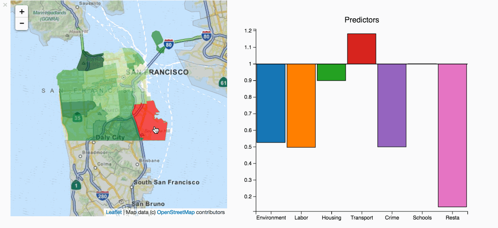

# An Analysis of Well-Being in San Francisco

This is a one-day project completed as part of the Bayes Impact hackathon.

Prompt
------

Housing inequality is present in cities across the United States, rendering low
income families unable to obtain affordable housing. Lack of fair housing
opportunities is just one of the problems communities face: many people also
lack access to transportation and services within the community. Both
communities and residents suffer when specific populations cannot utilize all
the resources communities have to offer. National and local data sets have been
created by initiatives that are addressing the gaps between residents in
communities.

Help cities enhance their use of data and evidence to uncover new ways to
revitalize neighborhoods and improve the lives of residents. Leverage federal
and local open data to identify disparities in access to resource, services,
and housing that communities need to thrive. Interactive informative tools that
show current trends, or tools to illustrate federal and local spending or
regulatory changes, have the potential to reinvent the way communities come
together and grow.

[Original Brief for The Project](http://bayeshack.org/housing-and-urban-development.html)

Goals
-----
This project aims at characterizing the livability of San Francisco
neighborhoods, and does so in 2 ways:
- By providing meaningful metrics for each neighborhood, related to crime,
  transportation, access to restaurants, together with tools to visuzalize
  them
- It investigates the relation between those features and the
  satisfaction of neighborhood residents.

Examples
--------

Visualizing features of neighborhoods using chloropleths.

Eploring the relationship between the features and the general level of
satisfaction of inhabitants.

Data and Methodology
--------------------
The satisfaction of inhabitants is inferred from surveys and the features are
inferred from census data, notably from <a href="http://datasf.org">datasf.org</a>.

The neighborhood features include:
- a <b>crime</b> index, calculated from the crime density of the area.
- access to <b>schools</b>, both public and private.
- access to <b>restauration</b> services, i.e. number of close restaurants and their respective ratings.
- <b>transportation costs</b>, <b>affordability</b>, <b>poverty</b>, <b>ethnicity</b> indices taken directly from census data.

Tools
-----

The project was developed with the Python and JavaScript programming languages.
The deliverable is an interactive document provided in the form of a Jupyter
notebook with advanced interactive visualizations based on leafletjs, bqplot,
d3.js.

Requirements
------------

To be able to run the project the following software is required:

 - Python Scientific Stack
   - [numpy](https://github.com/numpy/numpy)
   - [pandas](https://github.com/pydata/pandas) `>= 0.17.1`
   - [matplotlib](https://github.com/matplotlib/matplotlib) `>= 1.5.1`

 - Jupyter notebook and Interactive Widget Libraries
   - [Jupyter Notebook](https://github.com/jupyter/notebook) `>= 4.2`
   - [ipywidgets](https://github.com/ipython/ipywidgets) `>= 5.0.0`
   - [ipyleaflet](https://github.com/ellisonbg/ipyleaflet) `>= 0.2.0b5`
   - [bqplot](https://github.com/bloomberg/bqplot) `>= 0.6.1`

 - GIS library
   - [geopy](https://github.com/geopy/geopy) `>=1.10`

Geographical Data
-----------------

**sf_zipcodes.geojson:**

  A GeoJSON file that contains San Francisco zip code level topographical data. Each feature contains an attitude `id` which is the zip code associated with the `Polygon`.
